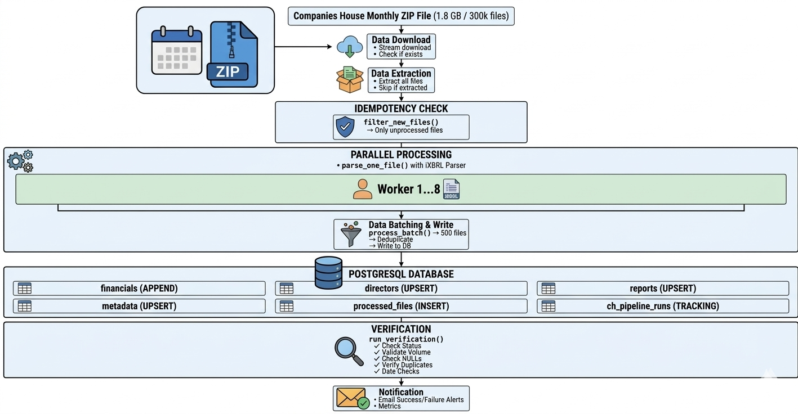

# Companies House Accounts Pipeline

A robust ETL pipeline for downloading, parsing, and storing Companies House accounts data from monthly iXBRL filings into PostgreSQL. Processes ~300,000 files per batch with parallel processing, intelligent write strategies, comprehensive error handling, and automated verification.

---

## 📋 Table of Contents
- [Project Overview](#project-overview)
- [Schema Design](#schema-design)
- [Architecture](#architecture)
- [Component Breakdown](#component-breakdown)
- [Trade-offs & Design Decisions](#trade-offs--design-decisions)
- [Verification](#verification)
- [Setup Instructions](#setup-instructions)
- [Usage](#usage)

---

## 🚀 Project Overview

This pipeline automates the ingestion of Companies House monthly accounts data:

| Stage | Description |
|-------|-------------|
| **Download** | Fetches monthly ZIP files (1.8 GB) from Companies House |
| **Extract** | Unzips ~300,000 iXBRL HTML files |
| **Parse** | Extracts structured data using ixbrlparse library |
| **Process** | Parallel processing with configurable workers |
| **Store** | Writes to PostgreSQL with appropriate write strategies |
| **Verify** | Automatic data quality checks after completion |

---

## 📊 Schema Design

### Database Tables

| Table | Strategy | Unique Constraint | Purpose |
|-------|----------|-------------------|---------|
| **financials** | APPEND ONLY | None | Preserves full time series of financial metrics across multiple filing periods |
| **directors** | UPSERT | (company_number, director_name) | Maintains latest director list only |
| **reports** | UPSERT | (company_number, section) | Stores latest narrative sections (strategic report, directors report, etc.) |
| **metadata** | UPSERT | (company_number, field) | Keeps latest company details (name, address, auditor, dormancy status) |
| **processed_files** | INSERT | source_file (PK) | Tracks which files have been successfully processed (idempotency) |
| **ch_pipeline_runs** | INSERT | ch_upload (PK) | Monitors pipeline execution per month (status, counts, timing) |

### Why These Choices?

#### Financials - APPEND ONLY
- **Reason**: Need full time series to track trends over multiple years
- **Example**: A company's revenue for 2023, 2024, 2025 should all be preserved
- **No unique constraint** allows multiple entries per company per metric across different periods

#### Directors/Reports/Metadata - UPSERT
- **Reason**: Only the latest filing matters for current data
- **Conflict handling**: `ON CONFLICT DO UPDATE` with latest values
- **Indexes**: `(company_number)` for efficient upsert operations

---

## 🏗️ Architecture

### Data Flow Diagram

  

**Data Flow:**
1. **Companies House** → Monthly ZIP download (1.8GB)
2. **Extract** → 289,254 HTML files
3. **Filter** → Remove already processed files
4. **Parallel Processing** → 8 workers parse files
5. **Batch Write** → 500 files per batch to PostgreSQL
6. **Verification** → Data quality checks
7. **Notification** → Email alerts on completion

---

## 🔧 Component Breakdown

### 1. Download/Extract Module (`pipeline_utils.py`)
- Checks if ZIP exists (skip if already downloaded)
- Extracts only if no HTML files found (skip if already extracted)
- Handles large files with streaming downloads

### 2. Parallel Processing (`multiprocessing.Pool`)
- 8 workers default (configurable via `.env`)
- Each worker parses one file independently
- Chunk size of 50 files for balanced load

### 3. Batch Database Writes
- **Financials**: `COPY` command for high-performance bulk insert
- **Other tables**: `execute_values` with `ON CONFLICT` for upserts
- **Batch size**: 500 files per commit

### 4. Idempotency Layer
- implemented on month level and also on files level
- `processed_files` table tracks successful files
- Pipeline checks against this table before processing
- Ensures safe re-runs without duplication

### 5. Retry Mechanism
- Failed files retried up to 3 times
- 5-second delay between retries
- Files still failing after retries logged for investigation

### 6. Verification Module
- Checks pipeline status
- Validates data volume
- Checks for NULLs and duplicates

### 7. Email Notifications
- Success emails with metrics
- Failure emails with error details
- Configurable via `.env` (`EMAIL_ENABLED`)

---

## ⚖️ Trade-offs & Design Decisions

### 1. Batch Size: 500 Files

- Smaller batches (100) → More database commits = slower performance

- Larger batches (2000) → Too much memory usage (500+ parsed results in memory)

- 500 files → Optimal balance between performance and memory constraints. Each batch of 500 parsed results fits comfortably in memory 

### 2. Parallel Workers: 8
- Fewer workers (4) → Lower CPU utilization, slower processing
- 8 workers → Optimal balance for typical hardware (4-8 core CPUs), maximizing CPU utilization without overwhelming the database connection pool.

### 3. Financials: CSV COPY vs INSERT
- **Why COPY?** 10x faster for bulk inserts
- **Trade-off**: Slightly more complex (temp file creation)
- **Alternative**: `execute_values` would work but slower

### 4. Idempotency via `processed_files` and `ch_pipeline_run`
- 
- **Why separate table?** Cleaner, faster, and handles empty files
- **Trade-off**: Extra table, but ensures true idempotency

### 5. Retry Logic (3 attempts, 5s delay)
- **Why 3 attempts?** Catches transient errors (file locks, network glitches)
- **Why 5s delay?** Allows system to recover without long waits
- **Trade-off**: Might delay completion, but prevents false failures

### 6. Error Handling Strategy
- Continue on individual file failures - pipeline doesn't stop for one bad file
- Log all failures - both in DB and log file for later analysis
- Don't rollback successful writes - partial success is acceptable

### 7. Verification 
- **Verification**: After pipeline completes, checks data quality
- **Not validation**: Doesn't stop pipeline on issues
- **Why?** Allows pipeline to complete, then alerts on problems

---

## ✅ Verification

### How to Confirm Pipeline Worked Correctly

Run these verification queries after pipeline completion and we can also integrate it in main pipline:
we can check the status of exceution for each montly in ch_pipeline_run table and  we can also integrate it in main pipline for automatic verification

## Future-proofing

# In config.py
from datetime import datetime

def get_current_month_url():
    """Dynamically generate URL for current month"""
    now = datetime.now()
    month_names = ['January', 'February', 'March', 'April', 'May', 'June',
                   'July', 'August', 'September', 'October', 'November', 'December']
    month_name = month_names[now.month - 1]
    year = now.year
    return f"https://download.companieshouse.gov.uk/Accounts_Monthly_Data-{month_name}{year}.zip"

    DOWNLOAD_URL = os.getenv("DOWNLOAD_URL", get_current_month_url())

## Setup Instructions

# Python 3.8+
python --version
# PostgreSQL 12+
psql --version

1. Clone Repository
git clone https://github.com/Hamza-Jamil121/companies-house-pipeline.git
cd companies-house-pipeline

2. Create Virtual Environment
python -m venv venv
source venv/bin/activate  # Linux/Mac
venv\Scripts\activate     # Windows

3. Install Dependencies
pip install -r requirements.txt

4. Configure Environment
update env as per db configuration or for download path

5. Run Pipeline
python run_pipeline.py

Check Failed Files